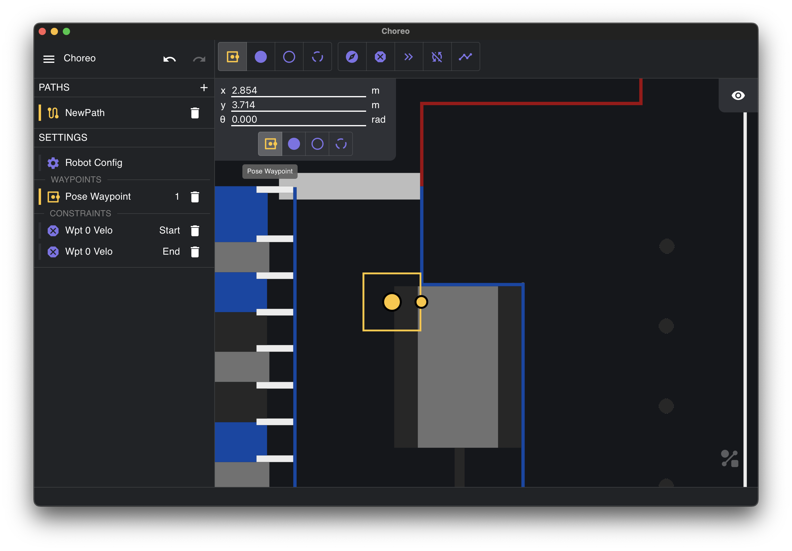

# Paths

Unlike traditional path planners that rely on user-defined splines, Choreo uses trajectory optimization to mathematically draw out the most optimal route through paths. Additionally, Choreo allows fine-grained customization while still maintaining concrete stability. A shift in paradigms from user-defined splines to trajectory optimization allows for more consistency and thus confience what the robot should be doing at any time.

## Waypoints

Waypoints define a change in movement that is fed to the trajectory optimizer, defining how the path is created. Instead of each waypoint just consisting of a position and heading, one can optionally customize many more options, or leave them to default values. You need at least two pose waypoints to buildm 

To add a waypoint, select the type of waypoint from the waypoints toolbar on the top to get started.

### Pose Waypoints

 

Pose Waypoints are the first button on the waypoints toolbar and consist of a heading but with an added heading or pose. This is a shortcut for creating a standard waypoint with a heading; one without a heading is a [Translation Waypoint](#translation-waypoints). This tells the optimizer that the robot must hit this position and rotation.

- **X and Y**: position in meters from the bottom left (origin)
- **θ**: Angular offset in radians 

      

### Translation Waypoints

Translation Waypoints are the second button on the toolbar and consists of a [Pose Waypoint](#pose-waypoints) but wihtout the added heading or pose. These share the same attributes that Pose Waypoints do. This tells the optimizer that the robot must hit this position at least once.

## Creating Paths

You can create paths by chaining waypoints together. Check out [Controls & Shortcuts](Controls-&-Shortcuts.md)

## Constraints

Constraints are limitations that the optimizer needs to respect while generating a path.